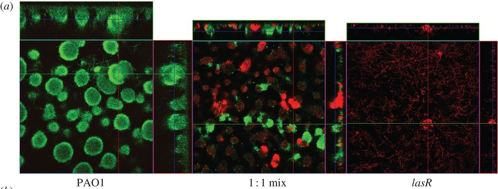

```{r setup, include=FALSE, message=FALSE}
options(htmltools.dir.version = FALSE)
library("jrPresentation")
set_presentation_options()
```

layout: true
`r add_border(inverse=TRUE)`
---

# My Story (relevant I promise!)

  

---

layout: false
`r add_border(inverse = TRUE)`

---

# Expose R to other people/things.


.pull-left[

- Web/Dashboard integrations
  
- App developers
  
- Data Scientists
  
- Other back-end systems

- And so on...

]

.pull-right[

  

]

---

layout: true
`r add_border(inverse=TRUE)`

---

# One option: A REST API

`www.some-address.de/some-functionality?with-parameters`

Examples:

`https://duckduckgo.com/?q=hamburg+R+user+group`

`https://www.imdb.com/find?q=batman&s=tt`

---

# `plumber` to the rescue

  - Creates a REST API
  
  - No specialist knowledge required to get started
  
  - Very easy to adapt existing code
  
  - Great documentation: https://www.rplumber.io/
  
Follow development:

Jeff Allen: https://github.com/trestletech/plumber

Rstudio: https://github.com/rstudio/plumber

---

class: center, middle inverse

# Demo

---

# My use cases

  - Providing forecasting interface for disease outbreak detection.
  
  - Providing recommendation algorithm for business.
  
  - Exposing SEO algorithms for marketing developers.

---

# Deployment Basic

  - Start with built in digital ocean method*
  
  - Entry point $5 per month
  
  - `plumber::do_deploy_api`

```{r echo=FALSE, out.width="200px"}

```

.footnote[[*] Plumber Docs https://www.rplumber.io/docs/hosting.html]

---

# Deployment Advanced

  - install web server manually and configure resources (Docker Compose or pm2)*
  
  - multiple R processes running concurrently
  
  - harder to do but more scaleable

```{r echo=FALSE, out.width="250px"}

```

.footnote[[*] Plumber Docs https://www.rplumber.io/docs/hosting.html]

---
  
# Deployment Experimental

  - Configure app engine on Google Cloud Compute*
  
  - Harder, less support but most scaleable and fully managed

```{r echo=FALSE, out.width="300px"}

```

.footnote[[*] Mark Edmonson https://github.com/MarkEdmondson1234/serverless-R-API-appengine]

---

# Appendix

  - Who is https://www.blockspring.com/ ?
  
  - How could you forget! [R Studio Connect](https://www.rstudio.com/products/connect/)
  
  - What about [Apple Core ML](https://developer.apple.com/documentation/coreml) or [Google ML Kit](https://developers.google.com/ml-kit/)

 - Microsoft/Azure ???
 
 - H2o Steam
 
 - Fiery
 
 - AWS/Lambda

---

# [jumpingrivers.com/dates](https://www.jumpingrivers.com/dates)

- Wed Jun 13 2018 - Introduction to R (Hamburg)

- Thu Jun 14 2018 - Mastering the tidyverse (Hamburg)

- Fri Jun 15 2018 - Next Steps in the Tidyverse (Hamburg)

- Wed Jun 20 2018 - Automated Reporting (first steps towards Shiny) (Hamburg)

- Thu Jun 21 2018 - Interactive Graphics with Shiny (Hamburg)

- Wed Jun 27 2018 - Predictive Analytics (Hamburg)

---

# Get started

  - github.com/rmnppt/plumber-tutorial
  
  - www.rplumber.io
  
---
